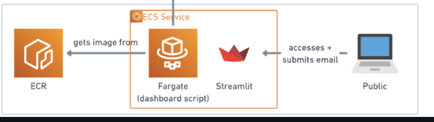

# Dashboard

## 🔎 Overview

### 📝 Description
> This directory focuses on the **dashbooard**. The goal of this directory is to use the data existing on the RDS by querying it to then **display complex visualisations** regarding the data scraped from the Bandcamp API. This results in trends regarding artists, tags and tracks being identified.

### 📋 Contents
Below is a list of the different pages on the dashboard:
- `Home` is the default page that users are sent to that shows top tracks and albums.
- `Artists` shows top artists and lets you go more in depth to compare artists with each other and see how they are performing.
- `Locations` shows a map of the world and lets you hover on it to see how popular a country is in terms of purchases being made.
- `Subscriptions` allows users on the dashboard to subscribe to notifications and pdf reports.
- `Tags` shows top tags and lets you go more in depth to compare tags with each other and see how they are performing.

## 📐 Architecture Diagram Explanation
Below is the snapshot which includes the relevant **AWS services** used in this directory from the Architecture Diagram at the root directory.

- **Dashboard**
  1. **ECR** service that is used as a container for the scripts required to host the dashboard which contain data that are obtained from querying the database. ECR is used so that the scripts can be hosted on the cloud and therefore this part of the tracker can be execute on the cloud.
  2. **Fargate** is easy to use and set up compared to alternatives which is fantastic for the purpose of the dashboard since we do not need to continuously access the machine, it only needs to host the service. The purpose of the Fargate is that it hosts the dashboard 24/7 so consumers can access Apollo's analytics whenever they want.
  3. **The Public** can access the dashboard whenever they want to find out analytics regarding their favourite artists, tags and tracks.

## 💻 Scripts

### 🐍 Python
- `charts.py` - Contains all the functions required to make the **altair charts** which are used on the dashboard
- `database.py` - - This script contains functions which contain all the different **queries** used to generate the charts on the dashboard.
- `tracker.py` - This script contains functions which set up the configurations for all the different pages on the dashboard

### 🐳 Docker
- `Dockerfile` - This script contains all the code required to successfully **dockerise the directory to an image**.

#### **IMPORTANT**
 >Refer back to the [**root README**](../README.md) if you need a reminder on how to run the Dockerfile script. 

## ❗️ Dependencies

### 📚 Libraries
- `requirements.txt` - This text file contains all the **required libraries** needed in order to run all the scripts contained within this directory.

#### **IMPORTANT**
 >Refer back to the [**root README**](../README.md) and go to the help section if you need a reminder on how to install these libraries.

### 🧪 Environment Variables
One thing to note is that all these scripts run using **environment variables** so you will need to create your own .env file and include them. Below is a list of all the environment variables:

- `DB_ENDPOINT`
- `DB_NAME`
- `DB_PORT`
- `DB_PASSWORD`
- `DB_USER`
- `ACCESS_KEY`
- `SECRET_ACCESS_KEY`

#### **IMPORTANT**
 >Refer back to the [**root README**](../README.md) and go to the help section if you need a reminder on how to setup environment variables.

