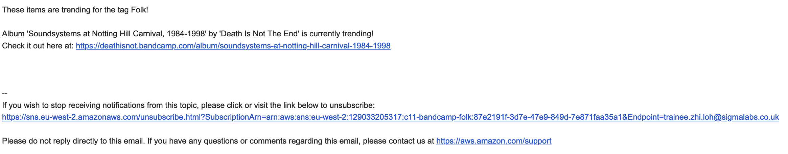
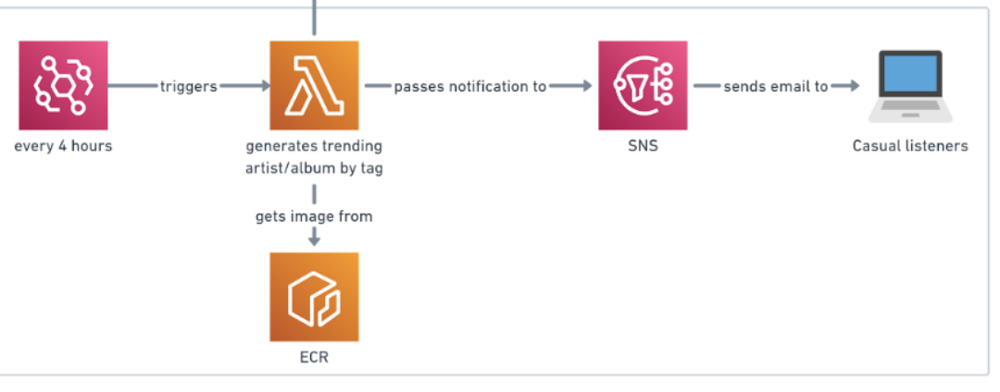

# Notifications

## 🔎 Overview

### 📝 Description
> This directory focuses on the **notification alerts** that are emailed to subscribers whenever something a user has subscribed to is trending. 

### 📋 Contents
Below is an **example** of how the PDF will look like.

1. The subscriber is **informed** which tags are trending if any.
2. The subscriber is **informed** if a specific track/album is trending and provided a link to it if they want to check it out.
3. There is a link provided at the bottom if the subscriber wishes to **unsubscribe**.

## 📐 Architecture Diagram Explanation
Below is the snapshot which includes the relevant **AWS services** used in this directory from the Architecture Diagram at the root directory.

- **Notifications**
  1. **ECR** service that is used as a container for the scripts required to send the alert. ECR is used so that the scripts can be hosted on the cloud and therefore this part of the tracker can be execute on the cloud.
  2. **AWS Lambda** function is another service that calls on the scripts which are contained in the image of the ECR. Whenever this function is called, the script is executed and an alert email is sent. Lambda is used because it is a cost-effective solution at the scale in which the tracker works and also because the PDF runs very quickly which satisfies the conditions of a Lambda. 
  3. **EventBridge** service is used to call the Lambda function so that it is called. This is necessary because without this trigger, none of the scripts would actually run. A cron expression is used which states that the trigger will be activated every 4 hours.
  4. **SNS** allows for the automation of any trending items such as tags or tracks to be sent to subscribers. It allows for different emails to be sent to different groups of subscribers and scales well.
  5. Anyone who is subscribed will receive this email whenever a track or album is trending. This will be particularly useful for casual listeners who want to discover new music.

## 💻 Scripts

### 🐍 Python
- `report.py` - This script is used to generate the actual report that is sent in the email. Run this script by using: `python3 generate_pdf.py` in the terminal.
- `test_report.py` - This script is used to test the report script to ensure it works.

### 🐳 Docker
- `Dockerfile` - This script contains all the code required to successfully **dockerise the directory to an image**.

#### **IMPORTANT**
 >Refer back to the [**root README**](../README.md) if you need a reminder on how to run the Dockerfile script. 

## ❗️ Dependencies

### 📚 Libraries
- `requirements.txt` - This text file contains all the **required libraries** needed in order to run all the scripts contained within this directory.

#### **IMPORTANT**
 >Refer back to the [**root README**](../README.md) and go to the help section if you need a reminder on how to install these libraries.

### 🧪 Environment Variables
One thing to note is that all these scripts run using **environment variables** so you will need to create your own .env file and include them. Below is a list of all the environment variables:

- `DB_PASSWORD`
- `DB_ENDPOINT`
- `DB_USER`
- `DB_NAME`
- `DB_PORT`
- `ACCESS_KEY`
- `SECRET_ACCESS_KEY`

#### **IMPORTANT**
 >Refer back to the [**root README**](../README.md) and go to the help section if you need a reminder on how to setup environment variables.

