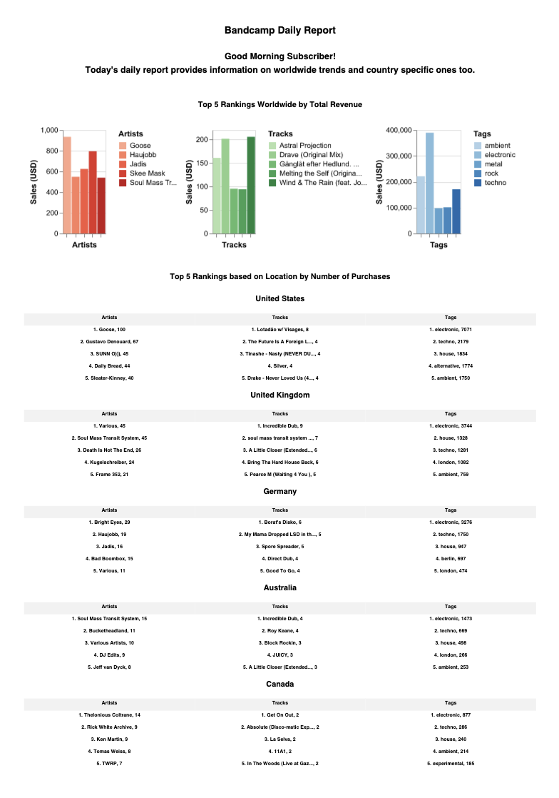
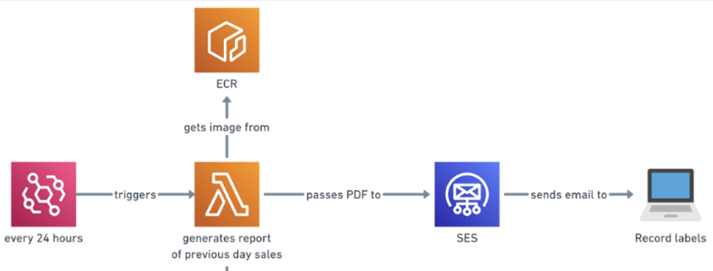

# PDF Report

## 🔎 Overview

### 📝 Description
> This directory focuses on the **PDF output of the tracker**. The goal of this directory is to use the data existing on the RDS by querying it to then **display basic analytics** regarding the data scraped from the Bandcamp API.

### 📋 Contents
Below is an **example** of how the PDF will look like.

1. The subscriber is **greeted** by a welcome message at the top.
2. Bar charts showing the **top 5 artists, tags and tracks** worldwide ranked by the **total revenue** they have made in USD.
3. Tables showing the **top 5 artists, tags and tracks** for a specific location ranked by the **total number of sales** they have made. The top 5 countries shown are ranked and picked based on the total revenue that the country has made in USD.

## 📐 Architecture Diagram Explanation
Below is the snapshot which includes the relevant **AWS services** used in this directory from the Architecture Diagram at the root directory.

- **PDF Report**
  1. **ECR** service that is used as a container for the scripts required to generate the PDFs which contain data that are obtained from querying the database. ECR is used so that the scripts can be hosted on the cloud and therefore this part of the tracker can be execute on the cloud.
  2. **AWS Lambda** function is another service that calls on the scripts which are contained in the image of the ECR. Whenever this function is called, the script is executed and a PDF report is generated. Lambda is used because it is a cost-effective solution at the scale in which the tracker works and also because the PDF runs very quickly which satisfies the conditions of a Lambda. 
  3. **EventBridge** service is used to call the Lambda function so that it is called. This is necessary because without this trigger, none of the scripts would actually run. A cron expression is used which states that the trigger will be activated every day at 9am. 
  4. **SES** allows for the automation of sending emails to a list of subscribers. These subscribers will be queried from the subscribers table in the database. Another reason it is used is because it can allow complex email structures such as adding attachments which in the context of this tracker, will be the pdf that is generated. 
  5. Anyone who is subscribed will receive this email at 9am however, these metrics will be extremely useful for record labels as they will provide useful insights on up and coming artists so that they know who to sign.

## 💻 Scripts

### 🐍 Python
- `charts.py` - Contains all the functions required to make the **altair charts** which are used to display the bar charts on the PDF.
- `generate_pdf.py` - Script that runs the actual **pdf generation**. This is the only script that is needed to run in order to generate the pdf and save it to the directory. Run this script by using: `python3 generate_pdf.py` in the terminal.
- `queries.py` - This script contains functions which contain all the different **queries** used to generate the charts and tables for the pdf.

### 🐳 Docker
- `Dockerfile` - This script contains all the code required to successfully **dockerise the directory to an image**.

#### **IMPORTANT**
 >Refer back to the [**root README**](../README.md) if you need a reminder on how to run the Dockerfile script. 

### 🎨 CSS
- `styles.css` - This script contains all the **styles** used in the HTML that is used to generate the pdf report.

## ❗️ Dependencies

### 📚 Libraries
- `requirements.txt` - This text file contains all the **required libraries** needed in order to run all the scripts contained within this directory.

#### **IMPORTANT**
 >Refer back to the [**root README**](../README.md) and go to the help section if you need a reminder on how to install these libraries.

### 🧪 Environment Variables
One thing to note is that all these scripts run using **environment variables** so you will need to create your own .env file and include them. Below is a list of all the environment variables:

- `DB_ENDPOINT`
- `DB_NAME`
- `DB_PORT`
- `DB_PASSWORD`
- `FILENAME`
- `CSS_PATH`

#### **IMPORTANT**
 >Refer back to the [**root README**](../README.md) and go to the help section if you need a reminder on how to setup environment variables.