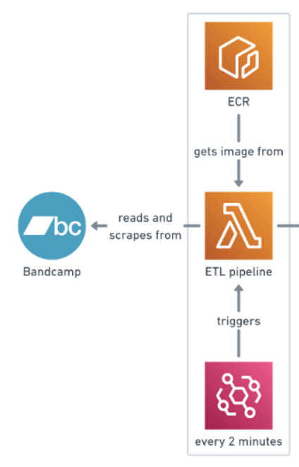

# ETL Pipeline

## 🔎 Overview

### 📝 Description
> This directory focuses on the **ETL Pipeline** that is used to insert the data scraped from the Bandcamp API into the database.

## 📐 Architecture Diagram Explanation
Below is the snapshot which includes the relevant **AWS services** used in this directory from the Architecture Diagram at the root directory.

- **PDF Report**
  1. **ECR** service that is used as a container for the scripts required to insert the data that is scraped into the database. ECR is used so that the scripts can be hosted on the cloud and therefore this part of the tracker can be execute on the cloud.
  2. **AWS Lambda** function is another service that calls on the scripts which are contained in the image of the ECR. Whenever this function is called, the script is executed and the data is inserted. Lambda is used because it is a cost-effective solution at the scale in which the tracker works and also because the PDF runs very quickly which satisfies the conditions of a Lambda. 
  3. **EventBridge** service is used to call the Lambda function so that it is called. This is necessary because without this trigger, none of the scripts would actually run. A cron expression is used which states that the trigger will be activated every 2 minutes.
  4. Bandcamp's API is the source of the data which is where all the data that is inserted into the database is scraped from.

## 💻 Scripts

### 🐍 Python
- `extract.py` - This script extracts the data from Bandcamp's API.
- `load.py` - This script loads the cleaned data into the rds. 
- `main.py` - This script is the only that needs to be called in order to run the pipeline. It runs all the other python scripts in the directory. Run this script by using: `python3 generate_pdf.py` in the terminal.
- `transform.py` - This script takes the extracted data and cleans it so that it can be ready to be inserted into the database.
- `test_x.py` - Any scripts labelled with a test at the front of them are the scripts which are used to test the other scripts in the directory to make sure that they are working.

### 🐳 Docker
- `Dockerfile` - This script contains all the code required to successfully **dockerise the directory to an image**.

#### **IMPORTANT**
 >Refer back to the [**root README**](../README.md) if you need a reminder on how to run the Dockerfile script. 

## ❗️ Dependencies

### 📚 Libraries
- `requirements.txt` - This text file contains all the **required libraries** needed in order to run all the scripts contained within this directory.

#### **IMPORTANT**
 >Refer back to the [**root README**](../README.md) and go to the help section if you need a reminder on how to install these libraries.

### 🧪 Environment Variables
One thing to note is that all these scripts run using **environment variables** so you will need to create your own .env file and include them. Below is a list of all the environment variables:

- `DB_PASS`
- `DB_HOST`
- `DB_USER`
- `DB_NAME`
- `DB_PORT`

#### **IMPORTANT**
 >Refer back to the [**root README**](../README.md) and go to the help section if you need a reminder on how to setup environment variables.