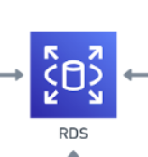

# RDS (Schema)

## 🔎 Overview

### 📝 Description
> This directory focuses on the **PDF output of the tracker**. The goal of this directory is to use the data existing on the RDS by querying it to then **display basic analytics** regarding the data scraped from the Bandcamp API.

## 📐 Architecture Diagram Explanation
Below is the snapshot which includes the relevant **AWS services** used in this directory from the Architecture Diagram at the root directory.

- **PDF Report**
  1. **RDS** services is used to host the database. This RDS is built using PostgreSQL. RDS is used because our tracker works based around OLAP and therefore AWS RDS has the best configurations for it.

## 💻 Scripts

### 📊 SQL
- `schema.sql` - This script contains all the code required to **build** the database that is used for the rest of the project.

### 🐢 Bash
- `connect.sh` - This script allows you to directly **connect** to the database.
- `reset.sh` - This script lets you **connect** to the database but also **reset** it.

## ❗️ Dependencies

### 🧪 Environment Variables
One thing to note is that all these scripts run using **environment variables** so you will need to create your own .env file and include them. Below is a list of all the environment variables:

- `DB_ENDPOINT`
- `DB_USER`
- `DB_NAME`
- `DB_PORT`
- `DB_PASSWORD`
- `DB_SCHEMA_FILE`

#### **IMPORTANT**
 >Refer back to the [**root README**](../README.md) and go to the help section if you need a reminder on how to setup environment variables.
